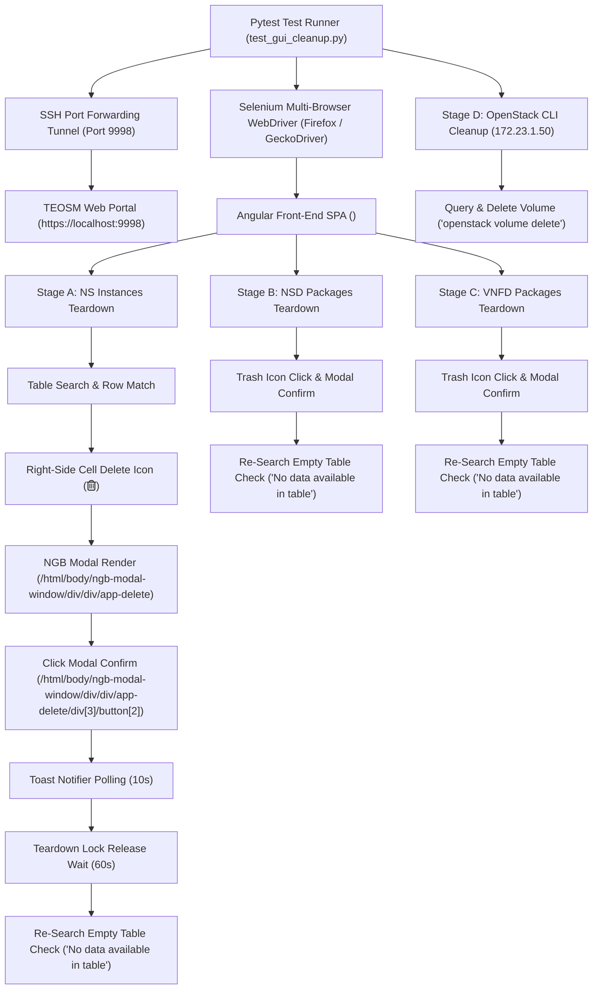

# TEOSM Web GUI & Cloud Resource Teardown Architecture & Protocol Specification

## 1. Architectural & Runtime Topology Layout

The TEOSM Web GUI & Cloud Teardown Automation component ([`automation/tests/test_gui_cleanup.py`](file:///home/bikash/workera/personal_git/cloud-automation/automation/tests/test_gui_cleanup.py)) automates end-to-end teardown and cleanup of deployed Network Service (NS) instances, NS Packages (NSD), VNF Packages (VNFD), and OpenStack cloud storage volumes/images.



---

## 2. Protocol & State Analysis (Finite State Machine)

### 2.1 Multi-Stage GUI Teardown Finite State Machine (FSM)

```mermaid
stateDiagram-v2
    [*] --> STAGE_A_NS: Navigate 'Instances' -> 'NS Instances'
    
    state STAGE_A_NS {
        [*] --> SEARCH_ROW_NS: Filter Table by Instance Name
        SEARCH_ROW_NS --> CLICK_DELETE_ICON_NS: Locate right-side <i class="far fa-trash-alt icons"></i>
        CLICK_DELETE_ICON_NS --> MODAL_CONFIRM_NS: Render /html/body/ngb-modal-window/div/div/app-delete
        MODAL_CONFIRM_NS --> TOAST_POLL_NS: Click /html/body/ngb-modal-window/div/div/app-delete/div[3]/button[2]
        TOAST_POLL_NS --> WAIT_60S: Poll Toast Notification Logs (10s)
        WAIT_60S --> RESEARCH_CHECK_NS: Wait 60s for Background Lock Release
        RESEARCH_CHECK_NS --> [*]: Confirm Table displays 'No data available in table'
    }

    STAGE_A_NS --> STAGE_B_NSD: Navigate 'Packages' -> 'NS Packages'

    state STAGE_B_NSD {
        [*] --> SEARCH_ROW_NSD: Filter Table by NSD Name
        SEARCH_ROW_NSD --> CLICK_DELETE_ICON_NSD: Locate right-side <i class="far fa-trash-alt icons"></i>
        CLICK_DELETE_ICON_NSD --> MODAL_CONFIRM_NSD: Render NGB Delete Modal Window
        MODAL_CONFIRM_NSD --> TOAST_POLL_NSD: Click Button[2] Confirmation
        TOAST_POLL_NSD --> RESEARCH_CHECK_NSD: Poll Toast Logs
        RESEARCH_CHECK_NSD --> [*]: Confirm Table displays 'No data available in table'
    }

    STAGE_B_NSD --> STAGE_C_VNFD: Navigate 'Packages' -> 'VNF Packages'

    state STAGE_C_VNFD {
        [*] --> SEARCH_ROW_VNFD: Filter Table by VNFD Name
        SEARCH_ROW_VNFD --> CLICK_DELETE_ICON_VNFD: Locate right-side <i class="far fa-trash-alt icons"></i>
        CLICK_DELETE_ICON_VNFD --> MODAL_CONFIRM_VNFD: Render NGB Delete Modal Window
        MODAL_CONFIRM_VNFD --> TOAST_POLL_VNFD: Click Button[2] Confirmation
        TOAST_POLL_VNFD --> RESEARCH_CHECK_VNFD: Poll Toast Logs
        RESEARCH_CHECK_VNFD --> [*]: Confirm Table displays 'No data available in table'
    }

    STAGE_C_VNFD --> STAGE_D_CLOUD_CLI: Connect to CLOUD_CLI SSH
    STAGE_D_CLOUD_CLI --> [*]: Execute 'openstack volume delete' & Image Discovery
```



---

## 3. Protocol & API Specification (DOM Element Locators & Interaction Contracts)

| Element / Stage | Component Type | Primary XPath / DOM Locator | Operational Contract |
| :--- | :--- | :--- | :--- |
| **Breadcrumb Header** | `<div>` / `<ol>` | `//*[contains(@class, 'breadcrumb-holder')]` | Assert active path matches section |
| **Table Search Box** | `<input>` | `//input[@type='search' or contains(@placeholder, 'Search')]` | `clear()` $\rightarrow$ `send_keys(query)` $\rightarrow$ `time.sleep(2)` |
| **Target Row Match** | `<tr>` | `//tr[contains(., '{search_term}')]` | Verify row text presence |
| **Row Delete Icon** | `<i>` / `<button>` | `.//td[last()]//i[contains(@class, 'fa-trash-alt')]` | `scrollIntoView()` $\rightarrow$ `click()` |
| **NGB Modal Container** | `<div>` | `/html/body/ngb-modal-window/div/div/app-delete` | Verify target resource name in message |
| **Modal Confirm Button** | `<button>` | `/html/body/ngb-modal-window/div/div/app-delete/div[3]/button[2]` | `scrollIntoView()` $\rightarrow$ `click()` |
| **Toast Notifier** | `<div>` | `//div[contains(@id, 'toast-container')]` / `//div[contains(@class, 'ngx-toastr')]` | Active 10s DOM polling (0.4s interval) |
| **Empty Table Message** | `<td>` / `<tr>` | `//td[contains(text(), 'No data available in table')]` | Re-search assertion post-deletion |

---

## 4. Performance & Operational Profile

- **Post-Instance Deletion Teardown Wait**: 60 seconds (1 minute) pause post-modal confirmation in Stage A for TEOSM/OSM background lock release.
- **Active Toast Log Polling**: 10-second polling loop executing every 0.4 seconds to capture asynchronous HTTP DELETE response toasts.
- **Empty Table Re-Search Verification**: Re-filters table post-teardown and asserts `"No data available in table"`.
- **Global Safety Switch (`DRY_RUN`)**:
  - `DRY_RUN = True`: Discovers resources and logs targets without executing clicks or deletes.
  - `DRY_RUN = False`: Performs real GUI deletions and CLI volume cleanup.

---

## 5. Verification Log & Test Coverage

### Test Execution Summary (`pytest -m clean_teosm_gui_cloud_volume_image tests/test_gui_cleanup.py`)

```text
====================== AUTOMATION SUITE EXECUTION SUMMARY ======================
✔ SUCCESS: All 3 test case(s) passed for marker 'clean_teosm_gui_cloud_volume_image'!
=======================================  =======================================
================== 3 passed, 6 warnings in 170.71s (0:02:50) ===================
```

### Empirical Execution Output Log

```text
2026-08-14 13:45:46 [INFO] --- Stage A: NS Instance Cleanup ---
2026-08-14 13:45:50 [INFO] ✔ VERIFIED BREADCRUMB-HOLDER: 'Dashboard Projects admin NS Instances'
2026-08-14 13:46:03 [INFO] --- Stage B: NS Package (NSD) Cleanup ---
2026-08-14 13:46:08 [INFO] ✔ VERIFIED BREADCRUMB-HOLDER: 'Dashboard Projects admin NS Packages'
2026-08-14 13:46:10 [INFO] ✔ VERIFIED ROW MATCH: Target name 'epdg_dp_node11_nsd' confirmed in table row text
2026-08-14 13:46:11 [INFO] ✔ Clicked TEOSM right-side row Delete icon (<i class='far fa-trash-alt icons'></i>).
2026-08-14 13:46:12 [INFO] ✔ VERIFIED MODAL POP-UP TEXT: Target resource 'epdg_dp_node11_nsd' confirmed in modal window message: 'Delete Are you sure want to delete epdg_dp_node11_nsd ? Cancel Ok'
2026-08-14 13:46:13 [INFO] ✔ Clicked NGB modal confirmation button (/html/body/ngb-modal-window/div/div/app-delete/div[3]/button[2]) for 'epdg_dp_node11_nsd'.
2026-08-14 13:46:53 [INFO] ✔ Successfully deleted NSD package 'epdg_dp_node11_nsd' via TEOSM GUI.
2026-08-14 13:46:53 [INFO] Re-searching table for target item 'epdg_dp_node11_nsd' to verify deletion...
2026-08-14 13:46:55 [INFO] ✔ VERIFIED POST-DELETION REMOVAL: Target item 'epdg_dp_node11_nsd' re-searched and confirmed removed. Table displays: 'No data available in table'
2026-08-14 13:47:05 [INFO] --- Stage C: VNF Package (VNFD) Cleanup ---
2026-08-14 13:47:08 [INFO] ✔ VERIFIED BREADCRUMB-HOLDER: 'Dashboard Projects admin VNF Packages'
2026-08-14 13:47:10 [INFO] ✔ Clicked TEOSM right-side row Delete icon (<i class='far fa-trash-alt icons'></i>).
2026-08-14 13:47:12 [INFO] ✔ Clicked NGB modal confirmation button (/html/body/ngb-modal-window/div/div/app-delete/div[3]/button[2]) for 'epdg_dp_node11_vnfd'.
2026-08-14 13:47:43 [INFO] ✔ Successfully deleted VNFD package 'epdg_dp_node11_vnfd' via TEOSM GUI.
2026-08-14 13:47:43 [INFO] Re-searching table for target item 'epdg_dp_node11_vnfd' to verify deletion...
2026-08-14 13:47:45 [INFO] ✔ VERIFIED POST-DELETION REMOVAL: Target item 'epdg_dp_node11_vnfd' re-searched and confirmed removed. Table displays: 'No data available in table'
```
