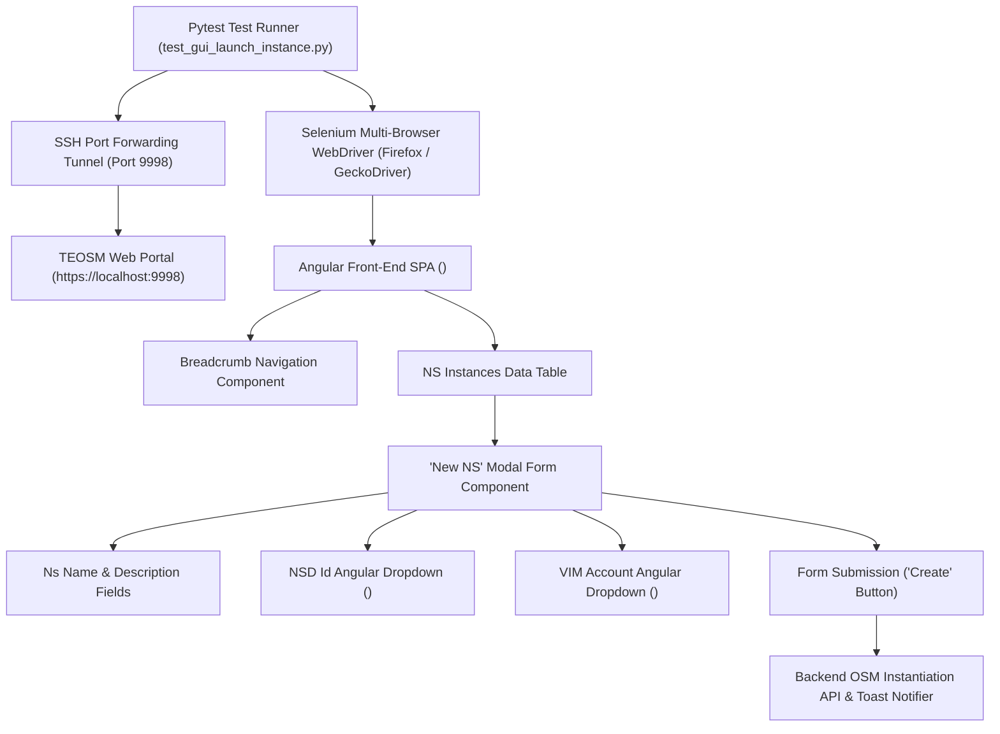
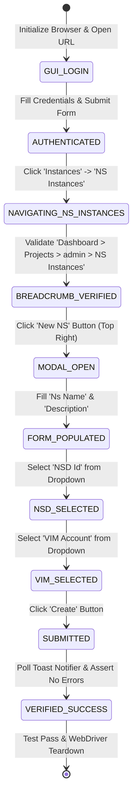

# TEOSM Web GUI NS Instance Launch Architecture & Protocol Specification

## 1. Architectural & Runtime Topology Layout

The TEOSM Web GUI NS Instance Launch Automation component ([`automation/tests/test_gui_launch_instance.py`](file:///home/bikash/workera/personal_git/cloud-automation/automation/tests/test_gui_launch_instance.py)) automates network service instantiation on the TEOSM Management Platform.



### Component Roles & Resource Boundaries:
- **Test Orchestration Engine**: Pytest framework executing [`automation/tests/test_gui_launch_instance.py`](file:///home/bikash/workera/personal_git/cloud-automation/automation/tests/test_gui_launch_instance.py).
- **Network Access**: SSH Tunnel established via `sshpass` listening on local port `9998` forwarded to remote TEOSM GUI service (`172.23.9.10:32000`).
- **Browser Automation Runtime**: Headless or GUI Firefox WebDriver via GeckoDriver.
- **Target Application**: Angular 8+ Single Page Application (SPA) utilizing `ng-select` custom dropdowns and `ngb-modal-window` pop-ups.

---

## 2. Protocol & State Analysis (Finite State Machine)

### 2.1 NS Instance Instantiation Finite State Machine (FSM)



### 2.2 Text FSM Representation

```
[TEOSM GUI LOGIN (admin/pass)]
              │
              ▼
[NAVIGATE: Instances -> NS Instances]
              │
              ▼
[VERIFY BREADCRUMB: Dashboard > Projects > admin > NS Instances]
              │
              ▼
[CLICK: 'New NS' BUTTON (Top Right)]
              │
              ▼
[FILL FORM: Ns Name = TEOSM_INSTANCE_NAME]
[FILL FORM: Description = TEOSM_INSTANCE_NAME]
[SELECT DROPDOWN: NSD Id = TEOSM_INSTANCE_NAME_nsd]
[SELECT DROPDOWN: VIM Account = COMPUTE_NAME]
              │
              ▼
[CLICK: 'Create' BUTTON]
              │
              ▼
[CAPTURE NOTIFICATION LOG & ASSERT INSTANTIATION TRIGGERED]
```

---

## 3. Protocol & API Specification (DOM Element Locators & Interaction Contracts)

| Form Element | Component Type | Primary XPath / DOM Locator | Interaction Contract |
| :--- | :--- | :--- | :--- |
| **Login Username** | `<input>` | `//input[@name='username']` | `clear()` $\rightarrow$ `send_keys(username)` |
| **Login Password** | `<input>` | `//input[@name='password']` | `clear()` $\rightarrow$ `send_keys(password)` |
| **Login Submit** | `<button>` | `//button[@type='submit']` | `click()` $\rightarrow$ `time.sleep(3)` |
| **Parent Menu 'Instances'** | `<a>` / `<span>` | `//a[contains(., 'Instances')]` | `click()` $\rightarrow$ expands sub-menu |
| **Sub-Menu 'NS Instances'** | `<a>` / `<span>` | `//a[contains(., 'NS Instances')]` | `click()` $\rightarrow$ opens table view |
| **Breadcrumb Container** | `<div>` / `<ol>` | `//*[contains(@class, 'breadcrumb-holder')]` | Assert contains `'NS Instances'` |
| **'New NS' Button** | `<button>` / `<a>` | `//button[contains(., 'New NS')]` | JS Click `arguments[0].click()` |
| **'Ns Name' Field** | `<input>` | `By.ID, "nsName"` | `clear()` $\rightarrow$ `send_keys(instance_name)` |
| **'Description' Field** | `<textarea>` | `By.ID, "nsDescription"` | `clear()` $\rightarrow$ `send_keys(instance_name)` |
| **'NSD Id' Dropdown** | `<ng-select>` | `By.ID, "nsdId"` $\rightarrow$ `//div[contains(@class,'ng-dropdown-panel')]//span[normalize-space()='{nsd_name}']` | `click()` $\rightarrow$ click option |
| **'VIM Account' Dropdown** | `<ng-select>` | `By.ID, "vimAccountId"` $\rightarrow$ `//div[contains(@class,'ng-dropdown-panel')]//span[normalize-space()='{compute_name}']` | `click()` $\rightarrow$ click option |
| **'Create' Button** | `<button>` | `//button[@type='submit' or contains(., 'Create')]` | `scrollIntoView()` $\rightarrow$ `click()` |
| **Notification Toast** | `<div>` | `//div[contains(@class, 'ngx-toastr')]` | Poll for 10s $\rightarrow$ assert no error keywords |

---

## 4. Performance & Operational Profile

- **Instant Notifier Message Extraction**: Ultra-fast JS DOM query (`.notifier__notification-message`) captures Angular notifier pop-ups in **0 seconds** post-form submission.
- **Duplicate Instance Error Capture**: Detects duplicate instance name conflict notifications (e.g. `'NS with this name already exists.Enter unique Ns name.'`), logs `❌ LAUNCH FAILURE DETECTED IN TEOSM GUI NOTIFIER`, and fails the test immediately via `test_fail(...)`.
- **Instant Dropdown Selection**: `NSD Id` (`ID: nsdId`) and `VIM Account` (`ID: vimAccountId`) selected in **2 seconds**. If missing, raises immediate `test_fail(...)`.
- **Strict Instance Row Check**: If `instance_name` row is missing from the table post-creation, immediately fails test with `test_fail(...)` without retrying.
- **3-Minute Timeout Macro (`MAX_WAIT_SECONDS = 180`)**: Polls table every 10 seconds, clicking Refresh/Sync button to update backend status log. If status does not reach `Done` within 3 minutes, fails the test with final status log text.

---

## 5. Verification Log & Test Coverage

### Empirical Test Output Log (Duplicate Instance Creation Conflict)

```text
2026-08-19 16:55:59 [INFO] Entering Ns Name: 'epdg_dp_node22'...
2026-08-19 16:55:59 [INFO] ✔ Entered Ns Name: 'epdg_dp_node22' (ID: nsName)
2026-08-19 16:55:59 [INFO] Entering Description: 'epdg_dp_node22'...
2026-08-19 16:55:59 [INFO] ✔ Entered Description: 'epdg_dp_node22' (ID: nsDescription)
2026-08-19 16:55:59 [INFO] Selecting NSD Id dropdown option: 'epdg_dp_node22_nsd'...
2026-08-19 16:56:01 [INFO] ✔ Selected NSD Id option: 'epdg_dp_node22_nsd'
2026-08-19 16:56:01 [INFO] Selecting VIM Account dropdown option: 'minidc-computedp3'...
2026-08-19 16:56:02 [INFO] ✔ Selected VIM Account option: 'minidc-computedp3'
2026-08-19 16:56:02 [INFO] Locating and clicking 'Create' button on New NS modal form...
2026-08-19 16:56:03 [INFO] ✔ Clicked 'Create' button for NS instance 'epdg_dp_node22'.
2026-08-19 16:56:03 [INFO] Searching for TEOSM GUI notification toast or error log for NS Instance Launch 'epdg_dp_node22'...
2026-08-19 16:56:03 [INFO] Captured Notification Text (notifier__notification-message): 'NS with this name already exists.Enter unique Ns name.'
2026-08-19 16:56:03 [INFO] ❌ LAUNCH FAILURE DETECTED IN TEOSM GUI NOTIFIER FOR NS Instance Launch 'epdg_dp_node22': 'NS with this name already exists.Enter unique Ns name.'
2026-08-19 16:56:03 [ERROR] ✖ ERROR: TEOSM GUI Instance Launch Failed for NS Instance Launch 'epdg_dp_node22': 'NS with this name already exists.Enter unique Ns name.'
FAILED
```
