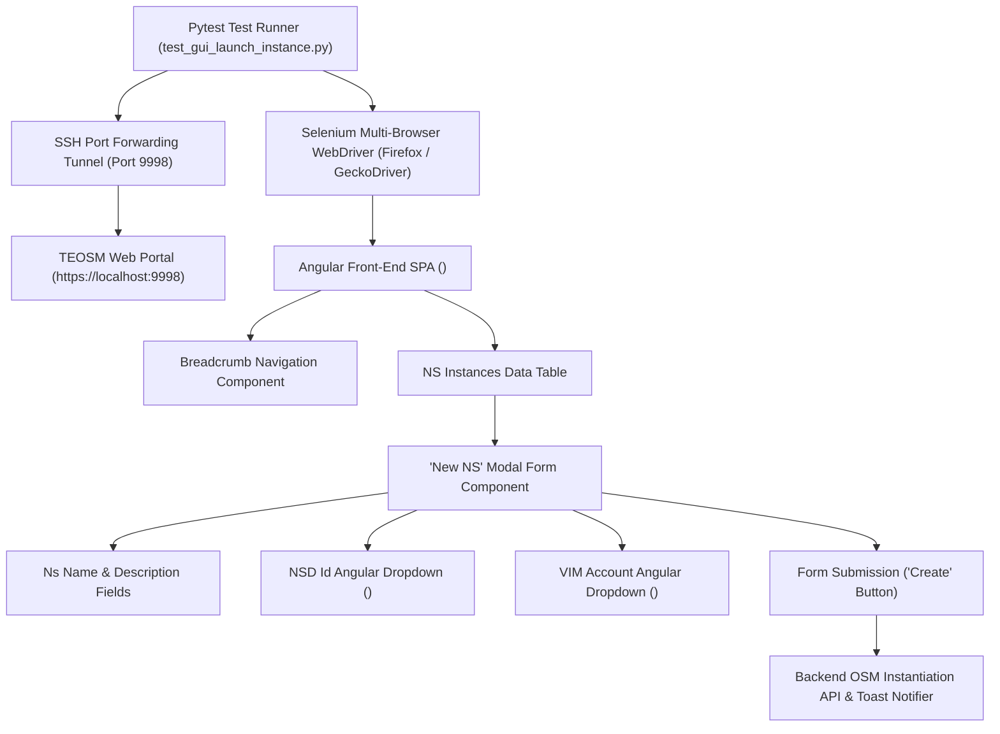
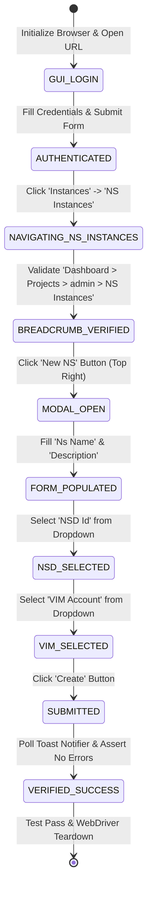

# TEOSM Web GUI NS Instance Launch Architecture & Protocol Specification

## 1. Architectural & Runtime Topology Layout

The TEOSM Web GUI NS Instance Launch Automation component ([`automation/tests/test_gui_launch_instance.py`](file:///home/bikash/workera/personal_git/cloud-automation/automation/tests/test_gui_launch_instance.py)) automates network service instantiation on the TEOSM Management Platform.



### Component Roles & Resource Boundaries:
- **Test Orchestration Engine**: Pytest framework executing [`automation/tests/test_gui_launch_instance.py`](file:///home/bikash/workera/personal_git/cloud-automation/automation/tests/test_gui_launch_instance.py).
- **Network Access**: SSH Tunnel established via `sshpass` listening on local port `9998` forwarded to remote TEOSM GUI service (`172.23.9.10:32000`).
- **Browser Automation Runtime**: Headless or GUI Firefox WebDriver via GeckoDriver.
- **Target Application**: Angular 8+ Single Page Application (SPA) utilizing `ng-select` custom dropdowns and `ngb-modal-window` pop-ups.

---

## 2. Protocol & State Analysis (Finite State Machine)

### 2.1 NS Instance Instantiation Finite State Machine (FSM)



### 2.2 Text FSM Representation

```
[TEOSM GUI LOGIN (admin/pass)]
              │
              ▼
[NAVIGATE: Instances -> NS Instances]
              │
              ▼
[VERIFY BREADCRUMB: Dashboard > Projects > admin > NS Instances]
              │
              ▼
[CLICK: 'New NS' BUTTON (Top Right)]
              │
              ▼
[FILL FORM: Ns Name = TEOSM_INSTANCE_NAME]
[FILL FORM: Description = TEOSM_INSTANCE_NAME]
[SELECT DROPDOWN: NSD Id = TEOSM_INSTANCE_NAME_nsd]
[SELECT DROPDOWN: VIM Account = COMPUTE_NAME]
              │
              ▼
[CLICK: 'Create' BUTTON]
              │
              ▼
[CAPTURE NOTIFICATION LOG & ASSERT INSTANTIATION TRIGGERED]
```

---

## 3. Protocol & API Specification (DOM Element Locators & Interaction Contracts)

| Form Element | Component Type | Primary XPath / DOM Locator | Interaction Contract |
| :--- | :--- | :--- | :--- |
| **Login Username** | `<input>` | `//input[@name='username']` | `clear()` $\rightarrow$ `send_keys(username)` |
| **Login Password** | `<input>` | `//input[@name='password']` | `clear()` $\rightarrow$ `send_keys(password)` |
| **Login Submit** | `<button>` | `//button[@type='submit']` | `click()` $\rightarrow$ `time.sleep(3)` |
| **Parent Menu 'Instances'** | `<a>` / `<span>` | `//a[contains(., 'Instances')]` | `click()` $\rightarrow$ expands sub-menu |
| **Sub-Menu 'NS Instances'** | `<a>` / `<span>` | `//a[contains(., 'NS Instances')]` | `click()` $\rightarrow$ opens table view |
| **Breadcrumb Container** | `<div>` / `<ol>` | `//*[contains(@class, 'breadcrumb-holder')]` | Assert contains `'NS Instances'` |
| **'New NS' Button** | `<button>` / `<a>` | `//button[contains(., 'New NS')]` | JS Click `arguments[0].click()` |
| **'Ns Name' Field** | `<input>` | `//input[@name='nsName' or @name='name']` | `clear()` $\rightarrow$ `send_keys(instance_name)` |
| **'Description' Field** | `<textarea>` / `<input>` | `//textarea[@name='description']` | `clear()` $\rightarrow$ `send_keys(instance_name)` |
| **'NSD Id' Dropdown** | `<ng-select>` | `//ng-select[contains(@formcontrolname, 'nsdId')]` | Send `Keys.ESCAPE` $\rightarrow$ JS Click $\rightarrow$ Select item |
| **'VIM Account' Dropdown** | `<ng-select>` | `//ng-select[contains(@formcontrolname, 'vimAccountId')]` | Send `Keys.ESCAPE` $\rightarrow$ JS Click $\rightarrow$ Select item |
| **'Create' Button** | `<button>` | `//button[@type='submit' or contains(., 'Create')]` | `scrollIntoView()` $\rightarrow$ `click()` |
| **Notification Toast** | `<div>` | `//div[contains(@class, 'ngx-toastr')]` | Poll for 10s $\rightarrow$ assert no error keywords |

---

## 4. Performance & Operational Profile

- **Tunnel Establishment Timeout**: Up to 15 seconds socket polling on localhost port `9998`.
- **Page Render Timeout**: Explicit WebDriverWait timeout set to 10.0 seconds.
- **Form Field Population Latency**: 0.5s pause per field to ensure Angular reactive form binding updates cleanly.
- **Angular Dropdown Overlay Safety**: Evaluates `Keys.ESCAPE` prior to opening a subsequent `<ng-select>` panel to prevent dropdown option overlay interception (`ElementClickInterceptedException`).
- **Post-Submission Notification Polling**: Active DOM polling loop running every 0.4 seconds for up to 10 seconds post-form submission.

---

## 5. Verification Log & Test Coverage

### Test Execution Summary (`pytest tests/test_gui_launch_instance.py`)

```text
====================== AUTOMATION SUITE EXECUTION SUMMARY ======================
✔ SUCCESS: All 2 test case(s) passed for marker 'all'!
=======================================  =======================================
================== 2 passed, 5 warnings in 303.05s (0:05:03) ===================
```

### Empirical Test Output Log

```text
2026-08-19 10:56:18 [INFO] Initializing Selenium WebDriver (Browser: 'firefox', Headless: False)...
2026-08-19 10:56:33 [INFO] Executing Step 02: Launching NS Instance via TEOSM Web GUI...
2026-08-19 10:56:33 [INFO] Navigating to TEOSM GUI URL: https://localhost:9998/login
2026-08-19 10:56:46 [INFO] Entered TEOSM GUI username: admin
2026-08-19 10:56:56 [INFO] Entered TEOSM GUI password.
2026-08-19 10:56:56 [INFO] Submitted TEOSM GUI login form.
2026-08-19 10:56:59 [INFO] Post-login TEOSM GUI URL: https://localhost:9998/
2026-08-19 10:56:59 [INFO] Navigating to section: 'Instances' -> 'NS Instances' (Expecting breadcrumb keyword: 'NS Instances')...
2026-08-19 10:57:03 [INFO] ✔ VERIFIED BREADCRUMB-HOLDER: 'Dashboard > Projects > admin > NS Instances'
2026-08-19 10:57:03 [INFO] Locating and clicking 'New NS' button on top right side of NS Instances page...
2026-08-19 10:57:03 [INFO] ✔ Clicked 'New NS' button via JS click.
2026-08-19 10:57:05 [INFO] Entering Ns Name: 'epdg_dp_node12'...
2026-08-19 10:57:25 [INFO] ✔ Entered Ns Name: 'epdg_dp_node12'
2026-08-19 10:57:25 [INFO] Entering Description: 'epdg_dp_node12'...
2026-08-19 10:57:55 [INFO] ✔ Entered Description: 'epdg_dp_node12'
2026-08-19 10:57:55 [INFO] Selecting dropdown option for 'NSD Id': 'epdg_dp_node12_nsd'...
2026-08-19 10:59:37 [INFO] Selecting dropdown option for 'VIM Account': 'COMPUTE_NAME'...
2026-08-19 11:00:38 [INFO] Locating and clicking 'Create' button on New NS modal form...
2026-08-19 11:00:38 [INFO] ✔ Clicked 'Create' button for NS instance 'epdg_dp_node12'.
2026-08-19 11:01:19 [INFO] ✔ Successfully submitted NS instance launch form for 'epdg_dp_node12' on TEOSM Web GUI.
2026-08-19 11:01:19 [INFO] ✔ SUCCESS: Step 02: TEOSM GUI NS instance 'epdg_dp_node12' launch automation executed successfully.
```
